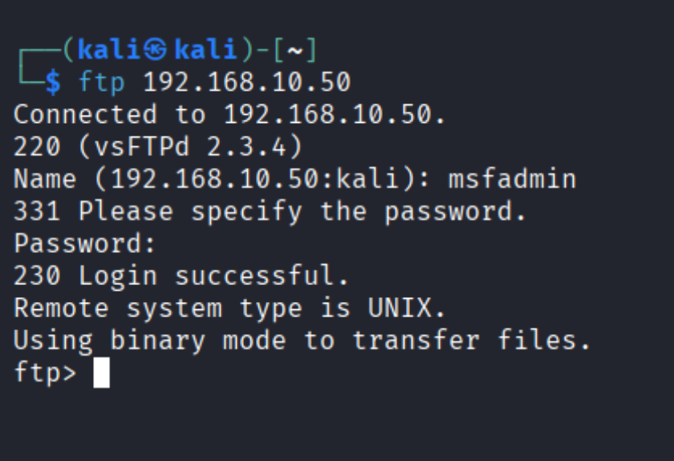
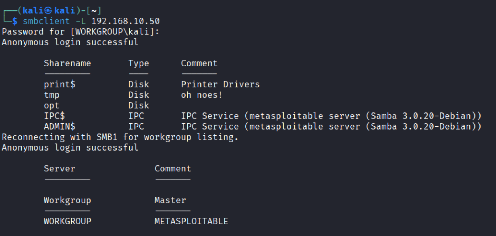
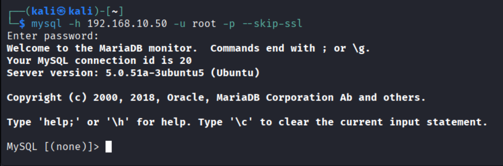
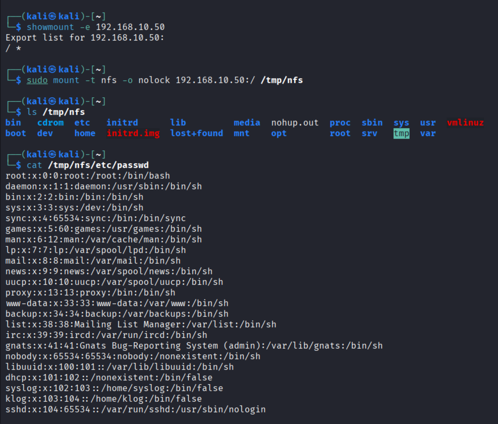
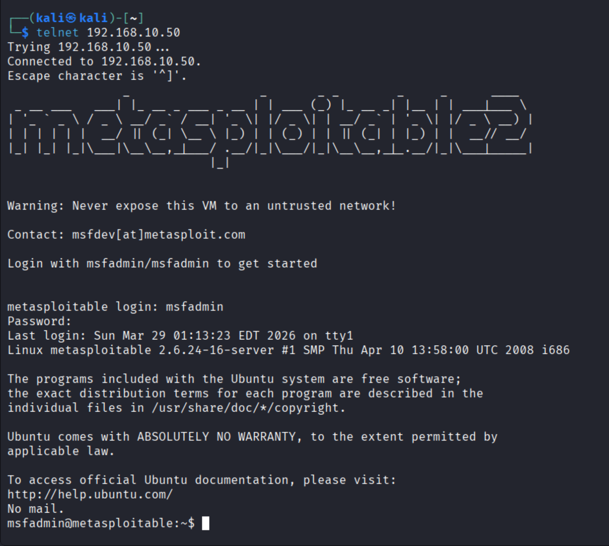
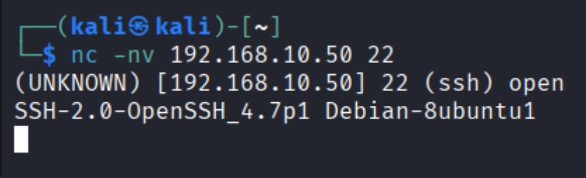
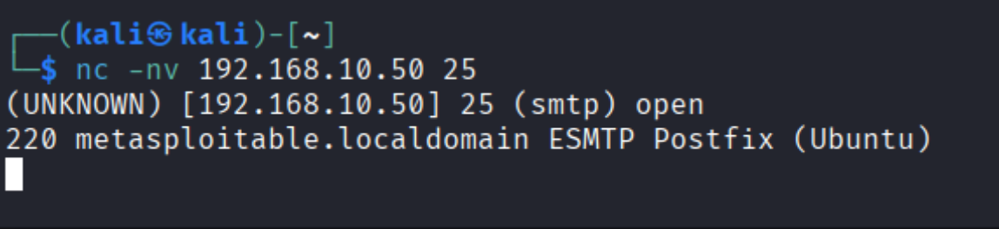
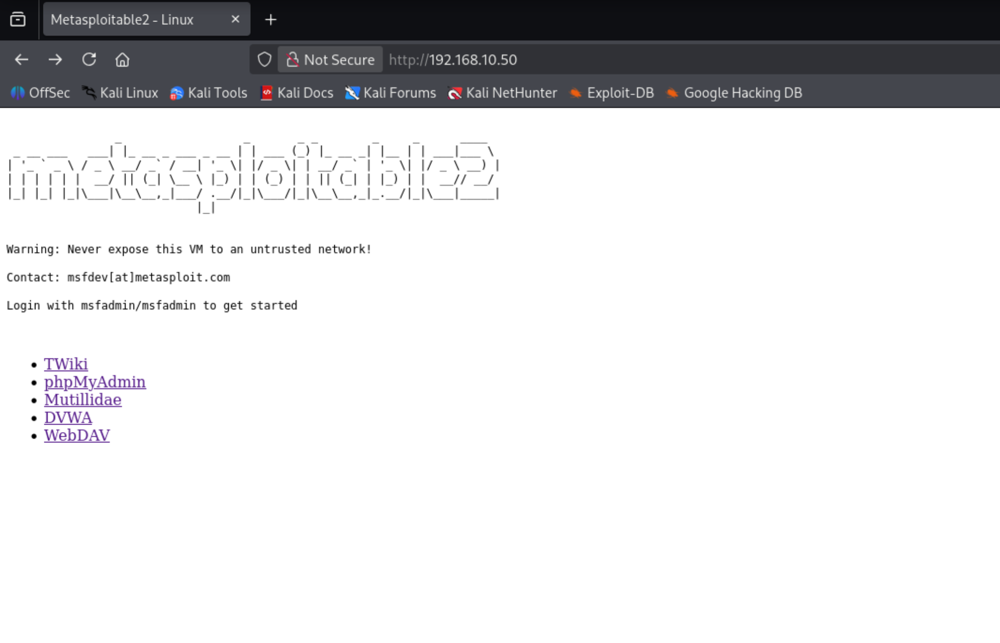
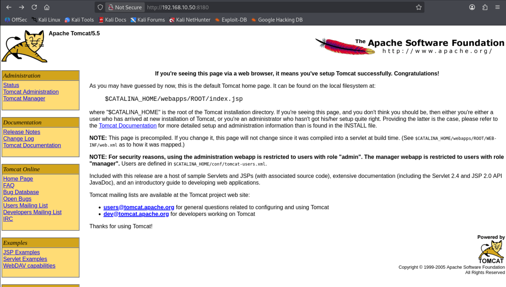
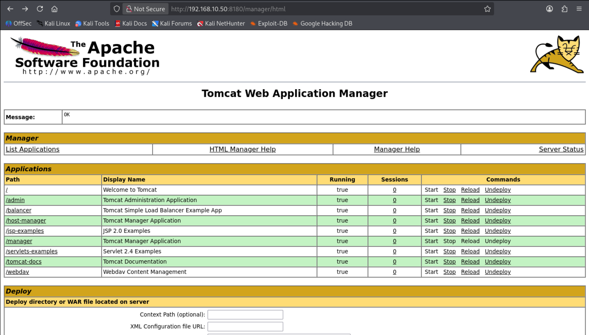

# 🔎 Phase 2: Enumeration

## 🎯 Objective
The objective of this phase is to gather detailed information about the identified services, including configurations, access points, and potential vulnerabilities.

---

## 🛠️ Tools Used
- FTP client
- Netcat
- smbclient
- MySQL client
- Telnet
- Web Browser

---

## ⚙️ Commands Used

```bash
ftp 192.168.10.50
smbclient -L 192.168.10.50
mysql -h 192.168.10.50 -u root -p --skip-ssl
showmount -e 192.168.10.50
telnet 192.168.10.50
nc -nv 192.168.10.50 22
nc -nv 192.168.10.50 25
```

---

## 🔎 Step-by-Step Enumeration

### 🔹 FTP Enumeration (Port 21)

```bash
ftp 192.168.10.50
```

📸 Screenshot:



---

### 🔹 SMB Enumeration (Port 139/445)

```bash
smbclient -L 192.168.10.50
```

📸 Screenshot:



---

### 🔹 MySQL Enumeration (Port 3306)

```bash
mysql -h 192.168.10.50 -u root -p --skip-ssl
```

📸 Screenshot:



---

### 🔹 NFS Enumeration (Port 2049)

```bash
showmount -e 192.168.10.50
```

📸 Screenshot:



---

### 🔹 Telnet Enumeration (Port 23)

```bash
telnet 192.168.10.50
```

📸 Screenshot:



---

### 🔹 SSH Verification (Port 22)

```bash
nc -nv 192.168.10.50 22
```

📸 Screenshot:



---

### 🔹 SMTP Enumeration (Port 25)

```bash
nc -nv 192.168.10.50 25
```

📸 Screenshot:



---

### 🔹 HTTP Enumeration (Port 80)

Accessed via browser:
```
http://192.168.10.50
```

📸 Screenshot:



---

### 🔹 Tomcat Enumeration (Port 8180)

Accessed via browser:
```
http://192.168.10.50:8180
http://192.168.10.50:8180/manager/html
```

📸 Screenshots:





---

## 📊 Key Findings

- FTP service allowed login access
- SMB shares were accessible anonymously
- MySQL service allowed connection attempts
- NFS exports exposed root directory (`/`)
- Telnet allowed remote login
- SMTP and SSH services confirmed active
- Web server exposed multiple vulnerable applications:
  - DVWA
  - Mutillidae
  - phpMyAdmin
- Tomcat Manager interface was accessible

---

## 🧠 Analysis

The enumeration phase revealed multiple misconfigurations and weak services. Several services allowed unauthorized or weakly protected access, significantly increasing the attack surface. These findings provided multiple entry points for exploitation in the next phase.

---
