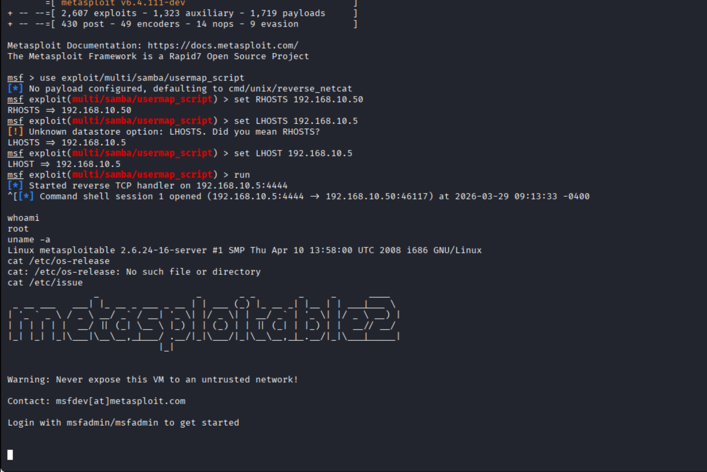
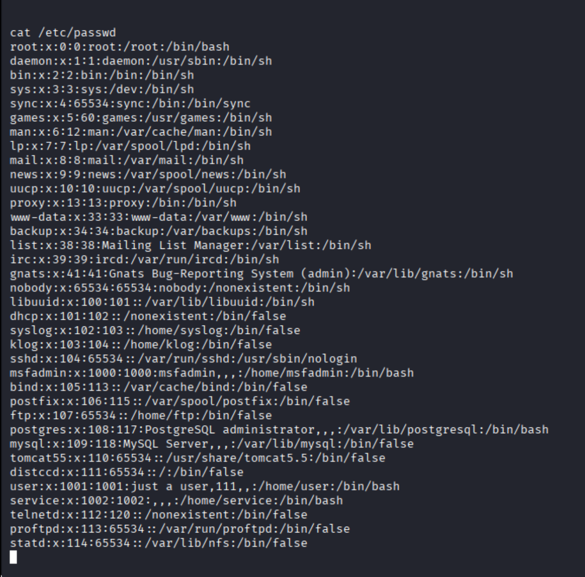
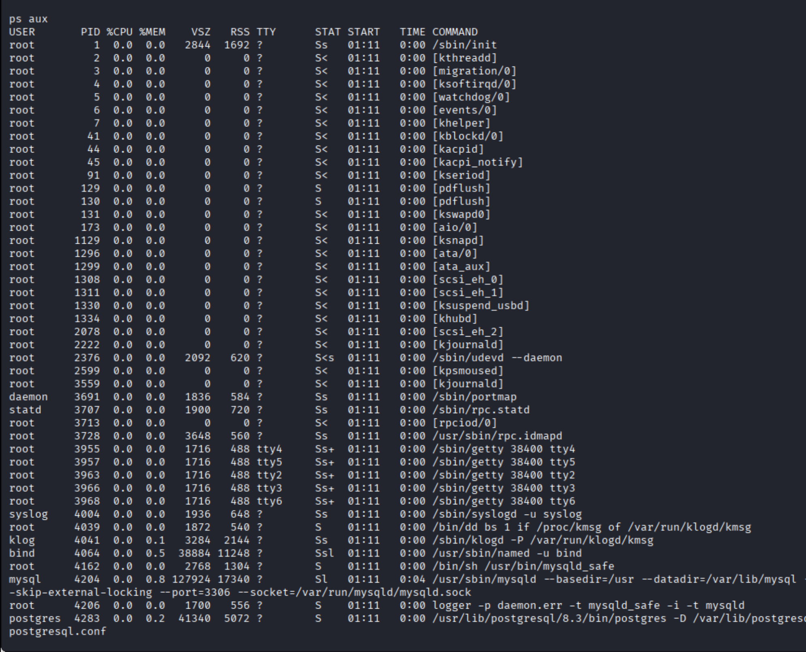
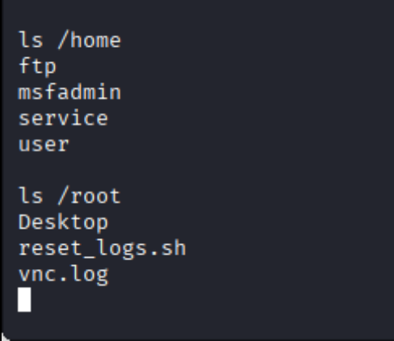

# 🔥 Phase 4: Post-Exploitation

## 🎯 Objective
The objective of this phase is to analyze the compromised system, gather sensitive information, and understand the impact of the attack.

---

## 🛠️ Tools Used
- Metasploit session
- Linux commands

---

## ⚙️ Commands Used

```bash
whoami
id
uname -a
cat /etc/issue
cat /etc/passwd
ls /home
ls /root
ps aux
```

---

## 🔍 Step-by-Step Post-Exploitation

---

### 🔹 1. Privilege Verification

```bash
whoami
id
```

📸 Screenshot:


---

### 🔹 2. System Information Gathering

```bash
uname -a
cat /etc/issue
```

📸 Screenshot:



---

### 🔹 3. User Enumeration

```bash
cat /etc/passwd
```

📸 Screenshot:



---

### 🔹 4. Running Services & Processes

```bash
ps aux
```

📸 Screenshot:



---

### 🔹 5. Sensitive Data Discovery

```bash
ls /home
ls /root
```

📸 Screenshot:



---

## 📊 Key Findings

- Root access was successfully obtained  
- Multiple user accounts were discovered  
- Sensitive directories such as `/root` were accessible  
- Running services revealed active applications like MySQL, PostgreSQL, and Samba  
- System information confirmed an outdated Linux kernel  

---

## 🧠 Analysis

Post-exploitation demonstrated the full impact of the attack. An attacker with root access can access sensitive directories, extract data, monitor processes, and fully control the system. This highlights the importance of proper system hardening and security configurations.

---
