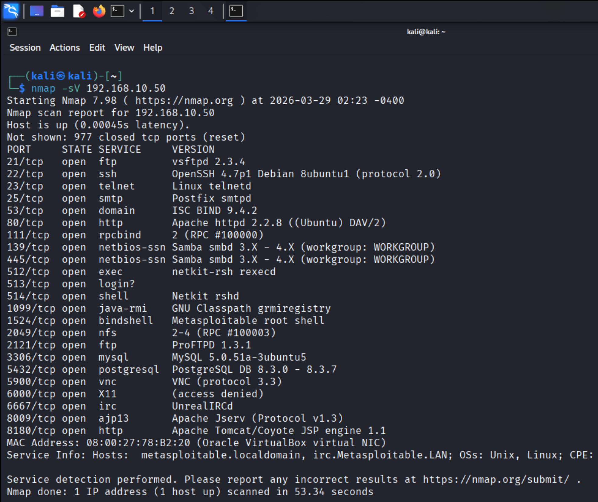
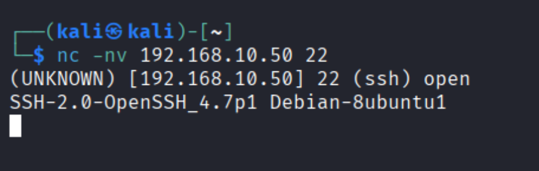
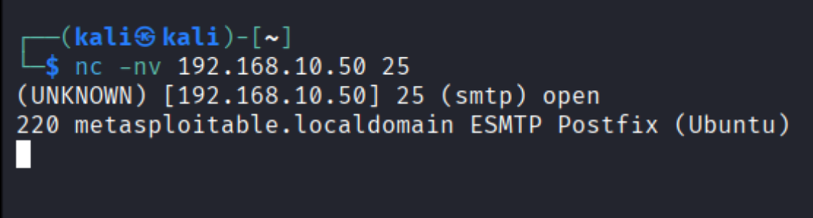

# 🔍 Phase 1: Reconnaissance

## 🎯 Objective
The objective of this phase is to identify open ports, running services, and system information of the target machine.

---

## 🛠️ Tools Used
- Nmap
- Netcat

---

## ⚙️ Commands Used

```bash
nmap -sV 192.168.10.50
nc -nv 192.168.10.50 22
nc -nv 192.168.10.50 25
```

---

## 🔎 Step-by-Step Execution

### 🔹 Step 1: Nmap Scan (Service Detection)

```bash
nmap -sV 192.168.10.50
```

📸 Screenshot:



---

### 🔹 Step 2: Verify SSH Service (Port 22)

```bash
nc -nv 192.168.10.50 22
```

📸 Screenshot:



---

### 🔹 Step 3: Verify SMTP Service (Port 25)

```bash
nc -nv 192.168.10.50 25
```

📸 Screenshot:



---

## 📊 Key Findings

- Multiple open ports were identified on the target system
- Critical services discovered:
  - FTP (21) – vsftpd 2.3.4
  - SSH (22) – OpenSSH 4.7p1
  - Telnet (23)
  - SMTP (25) – Postfix
  - HTTP (80) – Apache
  - SMB (139, 445) – Samba
  - MySQL (3306)
  - IRC (6667) – UnrealIRCd
- Service versions were successfully identified
- Manual verification confirmed that SSH and SMTP services are active

---

## 🧠 Analysis

The reconnaissance phase revealed a large attack surface with multiple exposed services. Both automated (Nmap) and manual (Netcat) techniques were used to validate service availability. These findings guided the next phase of enumeration.

---
